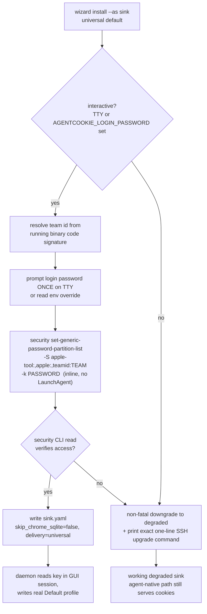

# feat: One-password SSH-safe keychain onboarding for universal cookie delivery

## Summary

A fresh `agentcookie wizard install --as sink` is supposed to land **universal** cookie delivery (the real Chrome `Default` profile written + the Safe Storage key readable by unmodified third-party cookie tools). Live QA on the production sink `moltbot-mini` proved the universal happy path does not land: the keychain-open step spawns a one-shot LaunchAgent that runs `delete-and-recreate` strategies, which trigger a storm of hanging macOS SecurityAgent GUI prompts, time out after 30s, and downgrade to degraded. The only thing that actually worked was a single manual command the operator typed over SSH:

```
security set-generic-password-partition-list -S "apple-tool:,apple:,teamid:<TEAM>" -k <login-pw> -s "Chrome Safe Storage" -a Chrome
```

That command is already 90% present in the codebase (`internal/chrome/keychain.go` `SetSafeStoragePartitionList` / `buildPartitionListArgv`) but is wired wrong: it omits `teamid:`, omits `-k`, is demoted to a "rarely succeeds" fallback, and runs inside the LaunchAgent instead of inline on the operator's TTY.

This plan rebuilds the onboarding around that command as the **primary** strategy: prompt for the login password **once** on the SSH/TTY session, compose the partition list with the agentcookie binary's own dynamically-resolved Dev-ID team, run it inline (no LaunchAgent, no GUI dialog), preserve the existing key value, and make the daemon read succeed cleanly afterward. The delete-and-recreate LaunchAgent path is demoted to an explicit, non-default fallback.

**Acceptance bar (operator-stated):** the entire universal setup runs over a plain `ssh` session, with **zero GUI approval windows**, and exactly **one** login-password entry (typed into a terminal prompt, not a SecurityAgent dialog). Zero password entries is not achievable — macOS hard-requires the login password to modify an existing keychain item's access, with no headless bypass — so "one terminal password over SSH" is the floor and the explicit target.

---

## Problem Frame

The universal delivery feature (plan `...-002`) and its verification runbook (plan `...-003`) are correct in intent. The failure is entirely in **how access to the Chrome Safe Storage key is granted**. Three concrete defects, all confirmed live:

1. **Wrong primary strategy.** `internal/cli/wizard_keychain.go` `buildStrategies` leads with `delete-and-recreate-with-A` (when `--any-app`) or `delete-and-recreate-with-T`. Both delete the Safe Storage item and must first read its value, and that read triggers SecurityAgent GUI prompts on both the keybase-CGO path and the `security`-CLI fallback. The operator clicked ~4 prompts; none "stuck" because the agentcookie read path is keybase-CGO (`SecItemCopyMatching`), which honors the keychain **partition list**, not the per-app ACL that an "Always Allow" click sets.

2. **Self-undoing.** Re-running `set-keychain-access --any-app` deletes the item and recreates it, **wiping** any partition list a prior correct run (or the operator) had set. The delete-and-recreate model fundamentally fights the partition model.

3. **Right command, wrong wiring.** The `partition-list:apple-tool,apple` strategy (`wizard_keychain.go:282`) is the correct mechanism but (a) omits `teamid:<team>` so agentcookie's own Dev-ID-signed CGO read is not covered, (b) omits `-k <login-pw>` so it fails with "password not correct" when run non-interactively in the LaunchAgent, and (c) runs inside the LaunchAgent (a GUI session with no TTY to prompt on) rather than inline on the operator's SSH session.

**macOS constraint (load-bearing, confirmed by the v0.10/v0.12 runbooks and live behavior):** modifying an existing keychain item's ACL/partition requires the login password via `SecKeychainItemSetAccessWithPassword`; there is no headless bypass. The `security set-generic-password-partition-list` command accepts that password via `-k`, which both authorizes the change **and** unlocks the login keychain for the call — which is precisely why it works over SSH where the keychain is otherwise locked (`-25308 User interaction is not allowed`).

---

## Why the partition approach is correct (and its honest boundary)

`apple-tool:,apple:,teamid:<TEAM>` covers three consumer classes with one item, no per-binary trust list, no delete:

- **`apple-tool:`** — the `/usr/bin/security` CLI. This is the read path for the popular unmodified cookie tools (`yt-dlp`, `pycookiecheat`, `browser_cookie3`, `gallery-dl`), all of which shell out to `security find-generic-password`. Covering this is what makes "any third-party tool just works" largely true.
- **`teamid:<TEAM>`** — Developer-ID-signed binaries from the operator's signing team, read via `SecItemCopyMatching`. This covers agentcookie's own primary CGO read path (the daemon) and any tool the operator signs with their team.
- **`apple:`** — Apple-signed system binaries.

**Boundary (state honestly, do not over-claim):** truly arbitrary **unsigned** CGO tools (e.g. someone's locally-compiled `kooky` or `rookie` binary that calls `SecItemCopyMatching` directly and is not Dev-ID-signed) are **not** covered by `teamid:` and do not go through the `security` CLI, so they remain the long tail. Covering them requires either signing them with the operator's team, adding them to a `-T` trust list, or the `-A` any-app nuke. The plan keeps `-A` available as an explicit opt-in fallback for a dedicated sink, but does not make it the default and does not claim the partition path covers it.

---

## High-Level Technical Design

Onboarding control flow after this change (universal install over SSH):



Key design inversions from today:
- **Primary strategy** flips from `delete-and-recreate` (LaunchAgent, GUI prompts, destroys value) to `set-partition-list -k` (inline, TTY/SSH, preserves value).
- **Execution context** flips from one-shot LaunchAgent (GUI session, no TTY, 30s timeout) to inline in the wizard process (SSH session, password prompt works, synchronous).
- **Success probe** flips from `KeybaseKeychainProbe` CGO (fails over SSH with `-25308` because the SSH session's keychain is locked) to a `security`-CLI read check (the `apple-tool:` partition now covers it, and it does not need the GUI session). Daemon-side CGO read is verified by the daemon's actual behavior in the GUI session, not by an SSH probe.

---

## Key Technical Decisions

- **KTD-1: One password via `-k`, inline on the TTY, is the primary path.** This is the only approach proven to work over SSH with no GUI dialog. The login password is supplied non-interactively to `security` via `-k`, which authorizes the partition change and unlocks the login keychain for that single call. Prompted once via `golang.org/x/term` on the controlling terminal; an `AGENTCOOKIE_LOGIN_PASSWORD` env override supports fully non-interactive automation (CI, headless re-runs) without a TTY.
- **KTD-2: Never echo, log, or persist the password.** Read into a byte slice, pass as a single `-k` argv element, zero the slice after the call. Never write it to `sink.yaml`, a log line, the LaunchAgent plist, or the strategy-outcome JSON. (Argv is visible in `ps` for the call's lifetime — acceptable and unavoidable for `security -k`; document it, do not work around it with env-passing that leaks differently.)
- **KTD-3: Resolve the team id dynamically from the running binary's signature**, never hardcode `NM8VT393AR`. A different operator who re-signs agentcookie with their own Developer ID must get *their* team in the partition. Resolve via `codesign -d --verbose=2 <self> 2>&1` parsing `TeamIdentifier=`, with a graceful fallback (omit `teamid:` and warn) when the binary is ad-hoc/unsigned.
- **KTD-4: Preserve the key value absolutely.** The partition path never deletes or rewrites the Safe Storage item, so the value is structurally untouched — this is strictly safer than even the value-preserving `delete-and-recreate-with-A` guard. The destructive `-A`/`-T` strategies are retained only behind explicit non-default flags for the dedicated-sink / unsigned-CGO tail.
- **KTD-5: Downgrade stays non-fatal, but actionable.** When no TTY and no env password exist, the install still lands a working degraded sink (agent-native cookie serving is unaffected) and prints the **exact** single command to run over SSH to upgrade to universal — not "click Always Allow on the prompt" (the stale GUI-centric guidance, which is wrong for a headless sink).
- **KTD-6: Success is verified by a `security`-CLI read, not the CGO probe.** Over SSH the CGO probe fails on a locked keychain regardless of partition correctness, so using it as the inline success gate produces false negatives (the live QA's red herring). The inline strategy verifies with `security find-generic-password -w` (covered by the freshly-set `apple-tool:` partition). The daemon's CGO read is a separate concern verified in the GUI session at runtime.

---

## Implementation Units

### U1. Team-aware, password-authenticated partition primitive

**Goal:** Give `internal/chrome/keychain.go` the building blocks to set the Safe Storage partition list with a supplied login password and an operator-specific team id, all unit-testable without shelling out.

**Files:**
- `internal/chrome/keychain.go` (modify)
- `internal/chrome/keychain_partition_test.go` (create)

**Approach:**
- Add `TeamPartitionList(teamID string) string` composing `apple-tool:,apple:,teamid:<teamID>`; when `teamID == ""`, return `DefaultPartitionList` unchanged (graceful fallback, security-CLI tools still covered).
- Add `BinaryTeamID(path string) (string, error)` that runs `codesign -d --verbose=2 <path>` and parses `TeamIdentifier=XXXX`. Return `("", nil)` (not an error) for ad-hoc/unsigned binaries so callers can fall back cleanly; return an error only on a genuine codesign execution failure.
- Extend `buildPartitionListArgv` to a variant that includes `-k <password>` when a password is provided, keeping the argv split out from the shell-out for testing. Add `SetSafeStoragePartitionListWithPassword(partitions, loginPassword string) error` that runs the `security` command with the password as a discrete `-k` argv element (never via stdin echo, never interpolated into a string).
- Keep the existing `SetSafeStoragePartitionList` (stdin/GUI path) for callers that already have an unlocked interactive keychain; the new `-k` variant is the SSH-safe one.

**Patterns to follow:** mirror the existing `buildPartitionListArgv` / `SetSafeStoragePartitionList` split in this same file; mirror the `execSecurityFunc` indirection seam in `wizard_keychain.go` for testability.

**Test scenarios:**
- `TeamPartitionList("NM8VT393AR")` returns `apple-tool:,apple:,teamid:NM8VT393AR`.
- `TeamPartitionList("")` returns `DefaultPartitionList` (no trailing `teamid:`).
- `buildPartitionListArgv` with a password includes `-k` immediately followed by the password value, and still carries `-s "Chrome Safe Storage" -a Chrome`.
- `buildPartitionListArgv` with empty password omits `-k` entirely (no empty `-k ""` element).
- `BinaryTeamID` parses `TeamIdentifier=NM8VT393AR` from a representative codesign stderr fixture (inject via a command-runner seam).
- `BinaryTeamID` on ad-hoc output (`TeamIdentifier=not set` / no line) returns `("", nil)`, not an error.

### U2. Promote the inline one-password partition strategy; demote delete-and-recreate

**Goal:** Make `set-partition-with-team` the primary, default keychain-access strategy, run **inline** in the wizard process (TTY/SSH, no LaunchAgent), and move the destructive LaunchAgent strategies behind explicit non-default flags.

**Dependencies:** U1

**Files:**
- `internal/cli/wizard_keychain.go` (modify)
- `internal/cli/wizard_keychain_test.go` (modify/create)

**Approach:**
- Add an inline primary strategy (not part of the LaunchAgent inner-runner loop): resolve self path via `agentcookieBinaryPath()`, resolve team via `chrome.BinaryTeamID`, obtain the login password (see U3's prompt helper / `AGENTCOOKIE_LOGIN_PASSWORD`), call `chrome.SetSafeStoragePartitionListWithPassword(chrome.TeamPartitionList(team), pw)`.
- Verify success with a `security find-generic-password -w` read (via `execSecurityFunc`) rather than `KeybaseKeychainProbe` — see KTD-6. Treat a clean partition-set exit plus a successful `security` read as success.
- Default `runSetKeychainAccess` (and the wizard-install caller) to this inline strategy. The existing `--inner-runner`/LaunchAgent loop and `delete-and-recreate-with-A`/`-T` strategies remain reachable only via explicit flags (`--any-app`, a new `--legacy-launchagent`/`--recreate`), documented as dedicated-sink / unsigned-CGO fallbacks.
- The inline path performs no delete and no LaunchAgent dispatch, so the 30s timeout no longer gates the happy path.

**Patterns to follow:** existing `kcStrategy` shape and `execSecurityFunc` seam; existing structured `strategyOutcome` reporting for consistent wizard output.

**Test scenarios:**
- The inline strategy composes a `set-generic-password-partition-list` call carrying `teamid:<resolved>` and `-k`, and performs **no** `delete-generic-password` call (assert via the `execSecurityFunc` stub recording).
- With the stub returning a successful `security -w` read, the strategy reports success without invoking `KeybaseKeychainProbe`.
- `AGENTCOOKIE_LOGIN_PASSWORD` set → strategy runs without attempting a TTY prompt.
- No password available (no TTY, no env) → strategy returns a clear, actionable error naming the env override and the manual command; it does **not** delete or recreate anything.
- `--any-app` still selects the (value-preserving) recreate fallback — existing guard behavior unchanged.

### U3. Wizard install: inline one-password step on the happy path; actionable non-interactive downgrade

**Goal:** `resolveSinkDeliveryWithKeychain` runs the U2 inline step when an interactive/SSH session (or env password) is present and lands universal in one shot; otherwise it keeps the non-fatal degraded downgrade but prints the exact one-line upgrade command.

**Dependencies:** U2

**Files:**
- `internal/cli/wizard.go` (modify)
- `internal/cli/wizard_test.go` (modify)

**Approach:**
- Add a password-acquisition helper: if `AGENTCOOKIE_LOGIN_PASSWORD` is set use it; else if `golang.org/x/term.IsTerminal` on the controlling fd, prompt once with `term.ReadPassword` ("macOS login password (sets Chrome Safe Storage access; entered once, not stored): "); else signal "non-interactive".
- In `resolveSinkDeliveryWithKeychain`: interactive/env → run U2 inline; on success write `sink.yaml` with `skip_chrome_sqlite=false` + `delivery: universal`. On failure or non-interactive → keep current downgrade to degraded (working sink preserved) and print the precise upgrade command (`agentcookie wizard set-keychain-access` over SSH, plus the `AGENTCOOKIE_LOGIN_PASSWORD=… ` non-interactive form).
- Replace the LaunchAgent/30s dependency on the universal happy path; retain it only when an explicit legacy/recreate flag is chosen.

**Patterns to follow:** existing `resolveSinkDeliveryWithKeychain` / `attemptUniversalKeychainOpen` seam and the existing non-fatal downgrade; existing `config.SinkConfig.Delivery` field.

**Test scenarios:**
- Interactive seam returns a password and the inline step succeeds → resolved mode is universal; `sink.yaml` written with `skip_chrome_sqlite=false`, `delivery: universal`.
- Non-interactive seam (no TTY, no env) → resolved mode is degraded; output contains the exact SSH upgrade command and the env-var form; install exit is success (non-fatal).
- Inline step fails (e.g. wrong password / `security` non-zero) → degraded, working sink preserved, error surfaced with remediation, no partial/half-universal `sink.yaml`.
- Covers the launch acceptance bar: an end-to-end install with a stubbed TTY password performs no LaunchAgent dispatch and no `delete-generic-password`.

### U4. Daemon read robustness + correct, non-GUI failure messaging

**Goal:** Ensure the sink daemon's `skip_chrome_sqlite=false` Safe Storage read succeeds once the team partition is set, and that its failure message points to the one-password SSH command rather than a nonexistent GUI prompt.

**Dependencies:** U1 (partition correctness is the actual fix)

**Files:**
- `internal/chrome/keychain.go` (modify — error text)
- `internal/cli/sink.go` (modify — read-failure remediation message)
- `internal/chrome/keychain_test.go` (modify)

**Approach:**
- The substantive read fix is the partition (U1/U2): with `teamid:<self-team>` present and the daemon running in the GUI session (login keychain unlocked), the keybase-CGO read returns the key with no prompt. No new read mechanism is required.
- Update the timeout error string in `SafeStoragePassword` and the `sink.go` hard-fail message: replace "click Always Allow on the prompt" with "run `agentcookie wizard set-keychain-access` over SSH (one login-password entry; no GUI prompt)". Keep the loud-fail-on-timeout behavior (do not silently hang).
- Audit the `safeStorageReadTimeout` (currently 10s): keep loud-fail semantics; only lengthen if the GUI-session read is observed to need it. Do not lower it.

**Test scenarios:**
- The timeout/`-25308` error message contains the one-password remediation command and does **not** instruct clicking a GUI prompt.
- `sink.go` skip=false read-failure path surfaces the same remediation text (assert message content via the read seam).
- `SafeStoragePassword` still attempts the keybase path before the `security` fallback (order unchanged).

### U5. Fix stale flag help + onboarding runbook

**Goal:** Documentation and `--skip-chrome-sqlite` help text reflect the universal default and the one-password partition onboarding.

**Dependencies:** U3

**Files:**
- `internal/cli/wizard.go` (modify — `--skip-chrome-sqlite` flag help string)
- `docs/runbook-v0.13-one-password-keychain.md` (create)
- `docs/runbook-v0.12-security-hardening.md` (modify — cross-link/supersede note)

**Approach:**
- Replace the stale `--skip-chrome-sqlite` help ("auto-set when no TTY") with text describing the universal default and that degraded is the fallback when the one-password step is skipped.
- New runbook documents: the partition mechanism, the one-password-over-SSH flow, the `AGENTCOOKIE_LOGIN_PASSWORD` env override, the honest unsigned-CGO boundary, and the rollback (`security delete-generic-password`/re-add is **not** needed since nothing is deleted; the partition can be narrowed with another `set-generic-password-partition-list`).

**Test scenarios:** `Test expectation: none -- doc + help-string change.` (Optional: a string assertion that the `--skip-chrome-sqlite` help no longer contains "auto-set when no TTY".)

---

## Verification & QA (post-build)

After U1–U5 land and a Dev-ID-signed binary is deployed to `moltbot-mini`, re-run the existing verification runbook **`docs/plans/2026-05-31-003-test-universal-delivery-verification-plan.md`** end-to-end over SSH, validating the launch acceptance bar specifically:

1. Fresh `wizard install --as sink` over `ssh shell`, no GUI session interaction, prompts for the login password exactly once on the SSH TTY (or consumes `AGENTCOOKIE_LOGIN_PASSWORD`), zero SecurityAgent windows.
2. `doctor` reports `Cookie delivery: universal` (not `partial`/`degraded`).
3. The real `Default` Chrome profile `Cookies` DB advances (daemon writes it) — the proof the daemon read the key.
4. Headline proof: an unmodified `security find-generic-password -s "Chrome Safe Storage" -w` succeeds (apple-tool path), demonstrating third-party-tool readability.
5. Value-preservation gate from runbook U3 still holds (a known cookie still decrypts) — structurally guaranteed since nothing is deleted, but verify.
6. Abort/rollback: narrowing the partition back to `apple-tool:,apple:` (drop `teamid:`) leaves a working degraded sink; no item deletion required.

---

## Scope Boundaries

**In scope:** the keychain-access onboarding mechanism (strategy, execution context, password handling, team resolution), the wizard-install wiring, the daemon read error messaging, the stale help text, and the onboarding runbook.

### Deferred to Follow-Up Work
- Covering arbitrary **unsigned** third-party CGO cookie tools (the long tail) beyond `apple-tool:` + `teamid:` — would require a signing/trust-list helper or the explicit `-A` opt-in; not part of the launch bar.
- Tesla PP CLI secret consumption proof (parked; separate effort).
- Any cli-printing-press / adapter-side changes.

### Non-goals
- Eliminating the single login-password entry (macOS-impossible; see Problem Frame).
- A GUI-based onboarding flow — the target is explicitly SSH/headless.

---

## Risks & Dependencies

- **R1: `codesign` parse fragility across macOS versions.** Mitigate with a tolerant parser and a clean `("", nil)` fallback (omit `teamid:`, security-CLI tools still covered); covered by U1 tests.
- **R2: Password handling leak.** Mitigate per KTD-2 (no log/persist/echo; argv-`ps` exposure documented as unavoidable for `security -k`).
- **R3: `-k` still prompts on some configurations.** If `-k` ever falls back to an interactive prompt, the inline TTY context can service it (unlike the LaunchAgent); the env override path remains for true non-interactive runs.
- **R4: Daemon GUI-session read still fails after partition.** The live QA was inconclusive here (the `--any-app` re-run had undone the partition before a clean test). U4 keeps loud-fail + actionable messaging; the QA step (Verification 3) is the authoritative check, with the degraded downgrade as the safety net if it regresses.
- **Dependency:** a Dev-ID-signed agentcookie binary on the sink (so `teamid:` matches the daemon's signature) — already the case on `moltbot-mini` (team `NM8VT393AR`).
