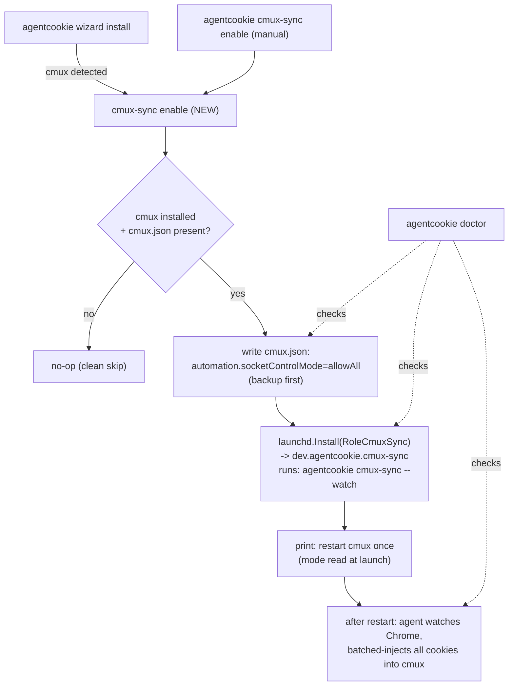

# feat: cmux local loop on by default when cmux is installed

Builds on the local loop (`agentcookie cmux-sync`, PR #86) and batched injection (PR #88). This plan makes that loop **automatic**: if cmux and agentcookie are both installed, your Chrome session continuously flows into cmux's browser with no flags, no manual command, and no per-use setup.

## Summary

Today the local loop exists but is opt-in and manual: you run `cmux-sync --watch` yourself, in a cmux pane, for it to work. The goal is "both installed -> it just works." This adds a re-runnable `agentcookie cmux-sync enable` that (1) sets cmux's `socketControlMode` so a background daemon can reach the socket, (2) installs a launchd agent running `cmux-sync --watch` over the full cookie set, and (3) prints the one-time "restart cmux" step; `wizard install` calls it automatically when cmux is detected. A `disable` tears it down, and `doctor` reports whether the loop is actually live.

The one unavoidable cost, surfaced honestly: the launchd agent is not a cmux child, so cmux's default `socketControlMode: cmuxOnly` blocks it. Turning the loop on therefore requires setting `allowAll` (or `password`) in `~/.config/cmux/cmux.json` and **one** cmux restart (the mode is read only at app launch). After that single restart it is permanent and hands-free. There is no cmux-native "auto-run a daemon" hook (`resumeCommands` is cmux-managed signed surface-resume approvals, not a startup hook), so launchd is the mechanism.

---

## Problem Frame

The local loop's value is "my agent's cmux browser is always logged in like my Chrome." That promise only lands if it is on by default. Right now a user must know the command exists, run it in a cmux pane, and keep that pane alive. The moment they close it or reboot, sync stops. "Both installed -> automatic" requires: a persistent runner (launchd), the socket opened to a non-cmux-child caller (the `cmuxOnly` gate), and install-time wiring that detects cmux and sets this up without the user asking.

Constraints discovered this session:
- The launchd agent is not a cmux child, so `cmuxOnly` rejects it. The mode must be `allowAll`/`password`, applied via `~/.config/cmux/cmux.json`, and cmux must be restarted once for it to take effect (no live RPC sets the mode; `reload-config` does not apply it).
- cmux has no startup-daemon config hook, so "run it as a cmux child to avoid the gate" is not available for the automatic case. (A user can still run `cmux-sync --watch` by hand inside cmux with no mode change; that stays supported, just not the default mechanism.)
- The injection adapter already batches and is resilient (PR #88), so full-cookie continuous sync is practical.

---

## Requirements

- R1. `agentcookie cmux-sync enable` makes the local loop persistent and automatic: it configures cmux's socket mode, installs a launchd agent running `cmux-sync --watch` (full cookie set), and is idempotent (safe to re-run).
- R2. `agentcookie wizard install` auto-runs the enable path when cmux is detected, so a fresh install with cmux present yields a working loop with no extra commands. When cmux is absent, it is a no-op (no error, no nag).
- R3. `agentcookie cmux-sync disable` cleanly removes the launchd agent; reverting the cmux socket mode is offered but not forced (other tools may rely on it).
- R4. Enabling writes `~/.config/cmux/cmux.json` (`automation.socketControlMode`) itself, backing up the file first, and clearly tells the user a one-time cmux restart is required for it to take effect.
- R5. `agentcookie doctor` reports the local-loop state end to end: launchd agent loaded, cmux reachable, socket mode not `cmuxOnly`, with the exact remediation when any piece is missing.
- R6. Nothing here changes the source->sink transport, pairing, or the injection adapter internals.
- R7. The manual path (`cmux-sync --once/--watch` run by hand, no mode change needed when run inside cmux) keeps working unchanged.

---

## Key Technical Decisions

- KTD1. Mechanism is a **launchd agent**, not a cmux startup hook. cmux exposes no "run a background command on launch" config; `terminal.resumeCommands` is cmux-managed signed surface-resume approvals, not a hook. launchd is also the established agentcookie pattern (`internal/launchd`).
- KTD2. Add a `cmux-sync` role to `internal/launchd` (`RoleCmuxSync`), so the agent is `dev.agentcookie.cmux-sync` running `agentcookie cmux-sync --watch`. Mirrors the existing source/sink roles; no new launchd machinery.
- KTD3. The enable/disable logic lives in a dedicated `agentcookie cmux-sync enable|disable` subcommand, and `wizard install` calls it. Re-runnable and testable on its own, rather than burying the logic in the wizard.
- KTD4. Enabling sets `automation.socketControlMode` to `allowAll` by default (the socket is user-only, so the marginal risk is low and it needs no secret). `--password` selects password mode (writes `socketPassword` + sets `CMUX_SOCKET_PASSWORD` in the agent env). One-time cmux restart required either way; the command states this prominently.
- KTD5. cmux.json is edited with a JSONC-aware, targeted writer (set/insert only `automation.socketControlMode`/`socketPassword`), backing up to a timestamped `.bak` first, preserving comments and other settings. Go has no JSONC round-trip, so this is a careful regex/structured edit, not `json.Marshal`. (A Python reference for this exact edit exists in the sibling agentmail-to-claude-code repo's `setup_cmux.py`; port the case logic.)
- KTD6. Default cookie scope for the agent is the full set (no `--domain`) -- "all my cookies" is the intent. The agent honors `source.yaml`'s `cmux.domain_filter` if the user set one.
- KTD7. Detection = cmux CLI present (`sinkpush.ResolveCmuxBinary` + stat) AND `~/.config/cmux/cmux.json` reachable. Absent cmux -> enable is a clean no-op so `wizard install` never errors on non-cmux machines.

---

## High-Level Technical Design

What `cmux-sync enable` wires up and how the pieces relate:

The runtime sync path itself (Chrome -> read pipeline -> CmuxAdapter -> cmux) is unchanged from the local-loop PRs; this plan only adds the always-on wiring around it.

---

## Implementation Units

### U1. launchd `cmux-sync` role

**Goal:** Let `internal/launchd` install/uninstall/detect a `cmux-sync` agent.

**Requirements:** R1, R3

**Dependencies:** none

**Files:**
- `internal/launchd/plist.go` (add `RoleCmuxSync`; allow it in `Build` validation; args become `["cmux-sync", "--watch"]` via Role + ExtraArgs)
- `internal/launchd/plist_test.go`

**Approach:** Add `RoleCmuxSync Role = "cmux-sync"`. Permit it in the role validation alongside source/sink. `Label()` yields `dev.agentcookie.cmux-sync`; `ProgramArguments` becomes the binary + `cmux-sync` + `ExtraArgs` (`--watch`). No other launchd changes.

**Test scenarios:**
- `Spec{Role: RoleCmuxSync, ExtraArgs: ["--watch"]}.Build()` yields Label `dev.agentcookie.cmux-sync` and ProgramArguments ending `cmux-sync --watch`.
- `Build` still rejects an unknown role.
- Plist path/log paths derive from the role name.

**Verification:** `go test ./internal/launchd/...` passes; a built plist loads under launchd in manual testing.

### U2. cmux.json socket-mode writer

**Goal:** Set `automation.socketControlMode` (and optional `socketPassword`) in `~/.config/cmux/cmux.json`, safely and idempotently.

**Requirements:** R4

**Dependencies:** none

**Files:**
- `internal/cmuxconfig/cmuxconfig.go` (new small package: locate cmux.json, set mode with backup, JSONC-preserving)
- `internal/cmuxconfig/cmuxconfig_test.go`

**Approach:** Locate `~/.config/cmux/cmux.json`. Back up to `cmux.json.<timestamp>.bak`. Set `automation.socketControlMode` via targeted edit across three shapes (existing uncommented key -> replace value; existing uncommented `automation` block -> inject key; no automation block -> insert one), preserving comments and unrelated settings. Idempotent: setting the same value is a no-op-equivalent. Optionally validate via `cmux config check` when the cmux binary is available.

**Execution note:** Test-first on the three JSONC shapes -- this is the bug-prone part (Go has no JSONC round-trip).

**Patterns to follow:** the sibling `agentmail-to-claude-code` repo's `setup_cmux.py` (the same three-case targeted edit, in Python) as the reference for the case logic; `internal/config` for path/backup conventions.

**Test scenarios:**
- Fresh template (all-commented automation) -> a real `automation.socketControlMode` is inserted; result parses as JSONC and keeps the schema/comments.
- Existing uncommented `socketControlMode` -> value replaced, file otherwise unchanged.
- Existing uncommented `automation` block without the key -> key injected inside it.
- Password mode -> both `socketControlMode: "password"` and `socketPassword` set.
- A backup `.bak` is created before write; re-running is safe (no duplicate blocks).
- Missing cmux.json -> clear typed error the caller can treat as "cmux not set up".

**Verification:** `go test ./internal/cmuxconfig/...`; `cmux config check` reports valid after a write.

### U3. `agentcookie cmux-sync enable|disable`

**Goal:** One command to make the loop persistent/automatic, and one to remove it.

**Requirements:** R1, R3, R4, R7

**Dependencies:** U1, U2

**Files:**
- `internal/cli/cmux_sync.go` (add `enable`/`disable` subcommands under the existing `cmux-sync` command; flags `--password`, `--no-restart-hint`)
- `internal/cli/cmux_sync_test.go`

**Approach:** `enable`: detect cmux (KTD7); if absent, print a clean "cmux not found, skipping" and exit 0 (so wizard can call it unconditionally). If present: write the socket mode via `internal/cmuxconfig` (U2), install the launchd agent via `internal/launchd` (U1) pointing at the resolved agentcookie binary with `cmux-sync --watch`, then print the one-time restart instruction and how to verify (`agentcookie doctor`). `disable`: uninstall the launchd agent; print how to revert the socket mode (do not force-revert -- other tools may use it). Both idempotent.

**Execution note:** Implement the cmux-absent no-op path test-first (it gates wizard safety).

**Patterns to follow:** `internal/cli/wizard.go` (launchd install + user messaging), `internal/cli/cmux_sync.go` (existing command + config resolution), `internal/launchd` Install/Uninstall.

**Test scenarios:**
- cmux absent -> `enable` is a no-op, exit 0, prints a skip line, installs nothing.
- cmux present -> writes socket mode (via a faked cmuxconfig writer), installs the launchd agent (faked launchd), prints the restart instruction.
- `enable` twice -> idempotent (no duplicate agent, single backup per change).
- `disable` -> uninstalls the agent; prints the revert hint; does not error if nothing was installed.
- `--password` -> writes password mode and sets the agent's `CMUX_SOCKET_PASSWORD`.

**Verification:** `agentcookie cmux-sync enable` on a cmux machine installs `dev.agentcookie.cmux-sync` and, after a cmux restart, cmux stays logged in hands-free; `disable` removes it.

### U4. Wizard auto-enable on cmux detection

**Goal:** Make it the default: `wizard install` sets up the loop when cmux is present.

**Requirements:** R2

**Dependencies:** U3

**Files:**
- `internal/cli/wizard.go` (call the enable path near the end of install, after the binary/log dir are resolved)
- `internal/cli/wizard_test.go`

**Approach:** At the tail of `runWizardInstall` (both source and sink installs), call the same enable routine U3 exposes. cmux-absent -> silent no-op (KTD7). Surface a concise line in the install summary ("cmux detected -- local loop enabled; restart cmux once to activate") so the one-time restart is visible. Gate behind a `--no-cmux` flag for users who want to opt out.

**Test scenarios:**
- Install with cmux present -> enable routine invoked; summary mentions the loop + restart.
- Install with cmux absent -> enable routine no-ops; no error, no cmux mention.
- `--no-cmux` -> enable skipped even when cmux present.

**Verification:** A fresh `wizard install` on a cmux machine yields a loaded `dev.agentcookie.cmux-sync` agent and the restart hint, with no extra commands.

### U5. Doctor: local-loop liveness

**Goal:** `doctor` tells the user whether the automatic loop is actually working.

**Requirements:** R5

**Dependencies:** U1, U3

**Files:**
- `internal/cli/doctor.go` (extend the existing `cmux local loop` check: also report whether `dev.agentcookie.cmux-sync` is loaded via `launchd.IsInstalled`, in addition to cmux reachability + socket mode)
- `internal/cli/doctor_test.go`

**Approach:** Build on the `checkCmuxDelivery` introduced for the source-side loop. When the local loop is configured/enabled, additionally check the launchd agent is loaded and the socket mode is not `cmuxOnly`; WARN with the precise next step when the agent is missing, the mode is still `cmuxOnly` (needs restart), or cmux is unreachable. OK only when agent loaded + mode open + cmux reachable.

**Test scenarios:**
- Agent loaded + mode allowAll + cmux reachable -> OK.
- Agent loaded + mode still `cmuxOnly` -> WARN "restart cmux to apply socketControlMode".
- Agent not loaded but cmux present -> WARN "run `agentcookie cmux-sync enable`".
- Source-only / loop disabled -> SKIPPED (regression of current behavior).

**Verification:** `agentcookie doctor` distinguishes "enabled but needs restart" from "not enabled" from "live".

### U6. Docs

**Goal:** Document the default-on behavior and the one-time restart.

**Requirements:** R2, R4, R5

**Files:**
- `README.md` (local loop section: it's automatic when cmux is installed; the one-time restart; enable/disable; doctor)
- `docs/quickstart.md` (note the auto-enable in the install flow)
- `CHANGELOG.md`

**Approach:** State that installing agentcookie with cmux present turns the loop on automatically (all cookies, continuous), requiring one cmux restart to activate; document `cmux-sync enable|disable`, the `--no-cmux` opt-out, and the doctor line. Carry the DBSC/ITP and signed-binary-no-prompt notes forward.

**Test scenarios:** Test expectation: none -- documentation only.

**Verification:** A reader understands that with both installed it just works after one restart, and how to turn it off.

---

## Scope Boundaries

In scope: the `cmux-sync enable|disable` command, the launchd role, the cmux.json socket-mode writer, wizard auto-enable, the doctor liveness check, and docs.

Outside this product's identity: changes to the source->sink transport or pairing; the injection adapter internals (PR #88); defeating DBSC.

### Deferred to Follow-Up Work
- localStorage/sessionStorage sync (carried from the local-loop deferred list).
- A live socket-mode apply that avoids the cmux restart (no cmux API exists today; revisit if cmux adds one).
- Auto-revert of `socketControlMode` on `disable` (today: print the revert hint, don't force it).

---

## Risk Analysis & Mitigation

- Editing the user's `cmux.json` automatically. Mitigation: timestamped backup before any write; targeted edit preserving comments/settings; `cmux config check` validation; idempotent.
- The one-time cmux restart is a real friction and easy to forget. Mitigation: prominent restart instruction at enable + install; `doctor` explicitly reports "enabled but needs restart" vs "live".
- `allowAll` opens the cmux socket to any local process running as the user. Mitigation: documented; `--password` available for a tighter posture; socket is already user-only.
- Wizard auto-enable on machines without cmux. Mitigation: detection no-ops cleanly (KTD7); `--no-cmux` opt-out.
- Full-cookie continuous injection load. Mitigation: batched + min-interval rate cap from the watcher (PRs #86/#88).
- Greptile review: resolve all findings before merge.

---

## Alternatives Considered

- **cmux `resumeCommands` to auto-launch the loop as a cmux child** (no restart, no mode change). Rejected: `resumeCommands` is cmux-managed signed surface-resume approvals, not a startup-command hook; there is no cmux-native way to auto-run a background daemon. The manual "run `cmux-sync --watch` inside cmux" path remains available for users who prefer no mode change, but it can't be the automatic default.
- **A login item / shell-profile launch instead of launchd.** Rejected: launchd is the established agentcookie agent pattern, integrates with `doctor`/uninstall, and is more robust than profile hacks.
- **Bury enable logic directly in the wizard.** Rejected (KTD3): a standalone `cmux-sync enable` is re-runnable and unit-testable; the wizard just calls it.

---

## Sources & Research

- launchd extension point: `internal/launchd/plist.go` (`Role`, `Spec`, `Build`, `Install`/`Uninstall`/`IsInstalled`; roles currently source/sink, `Label() = dev.agentcookie.<role>`).
- Wizard install flow to hook: `internal/cli/wizard.go` (`runWizardInstall`, `wizardInstallSource`/`Sink`, launchd install + summary messaging).
- The local loop + adapter this builds on: `internal/cli/cmux_sync.go`, `internal/sinkpush` (`CmuxAdapter`, `ResolveCmuxBinary`), and `docs/plans/2026-06-03-002-feat-cmux-local-loop-plan.md`.
- cmux socket-mode facts (verified this session): `socketControlMode` read only at app launch; no live RPC to set it; `reload-config` doesn't apply it; `cmuxOnly` rejects non-cmux-child callers. `terminal.resumeCommands` is signed surface-resume approvals (cmux schema), not a startup hook.
- cmux.json edit reference: the sibling `agentmail-to-claude-code` repo's `setup_cmux.py` (same three-case targeted JSONC edit, in Python).
