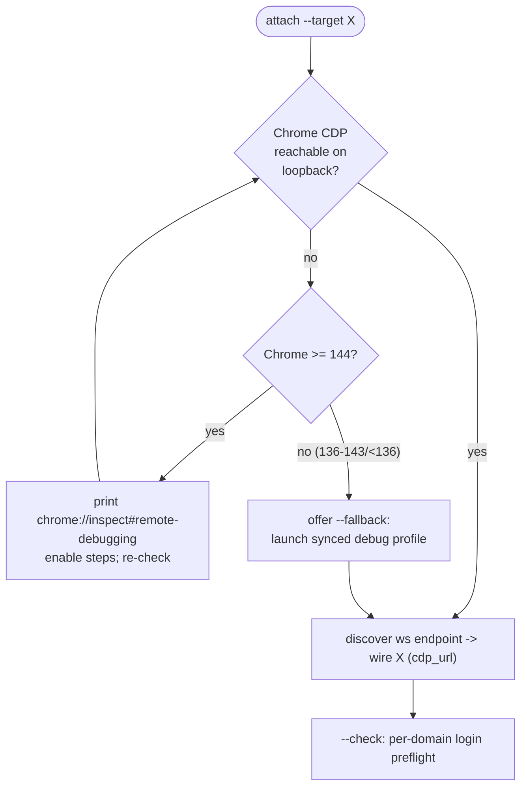

# feat: attach the agent browser to your real Chrome session

Closes the gap behind "are you sure you're logged in?" When an agent drives **browser-use** (or vercel-labs **agent-browser**) for HAR sniffing or navigation, that browser runs an empty Chromium profile and every site shows logged-out. agentcookie already closes this loop for cmux's WebKit pane (`cmux-sync` -> `CmuxAdapter`); this plan adds the equivalent for the Chromium agent browsers, using the approach you picked: **attach the agent browser to your real Chrome over CDP** so it shares your actual cookies, localStorage, and device-bound sessions rather than receiving a copy.

## Summary

The robust fix for a Chromium agent browser is not to copy session state into it but to point it at the browser that already has the state. browser-use exposes `cdp_url` and agent-browser speaks CDP; both can attach to a running Chrome instead of launching their own. On your machine (Chrome 148) the attach can target your **real default profile** via Chrome 144+'s `chrome://inspect#remote-debugging` / autoConnect path, so logins, localStorage, and DBSC-bound sessions all match with zero copying.

agentcookie's new job is to be the broker: detect whether the real Chrome is CDP-reachable, guide the one-time enablement when it isn't, discover the endpoint, wire the configured agent browsers to it, and verify the attach is live (a real "are you logged in" preflight). A copy-based fallback exists for when real-profile attach is unavailable or declined: a dedicated debug-profile Chrome kept in sync (cookies + localStorage) from your default profile, which the agent browser attaches to instead. cmux's WebKit pane cannot attach to Chrome's CDP, so its existing injection loop is hardened to also carry localStorage and to surface why a session is missing.

**Target repo:** agentcookie (this repo). browser-use config lives at `~/.config/browseruse/config.json`; agent-browser config path is discovered at implementation time.

---

## Problem Frame

Three distinct agent browsers, three states today:

- **claude-in-chrome** drives your real Chrome already, so it is logged in. Not in scope.
- **cmux** WebKit pane has a working same-machine loop (`agentcookie cmux-sync`, PR #86 + the cmux-local-loop plan) but it injects **cookies only**; localStorage-token sites and DBSC-bound sites still read as logged-out.
- **browser-use** and **agent-browser** (both Chromium) have **no loop at all**. browser-use's `~/.config/browseruse/config.json` ships `user_data_dir: null` -> a fresh ephemeral profile every run -> universally logged-out. This is the surface the user hits during PP HAR sniffing (`cli-printing-press/internal/browsersniff` ingests the capture browser-use produces).

Why a copy-based loop (the cmux pattern) is the wrong primary fix for the Chromium browsers:

- **DBSC / device-bound session cookies cannot be replayed** into a different browser or profile — the private key lives in the OS keystore and is bound to the originating browser binding, not the cookie jar. Copying the cookie row produces a cookie the server rejects. This is a leading cause of "often it says I'm not [logged in]."
- **Auth in localStorage/IndexedDB**, common in SPAs, is not carried by a cookies-only loop.

Attaching the agent browser to the real Chrome sidesteps all of it: there is one session, not a copy.

The cost, accepted in scoping: the agent then drives your **live** Chrome session, and CDP remote debugging on a real profile is exactly the surface Chrome 136 locked down (an open debug port lets any local process drain cookies). The plan treats the debug endpoint as sensitive: loopback-only, prefer the user-gated 144+ autoConnect path, never widen it silently.

---

## Requirements

- R1. `agentcookie attach` makes a configured Chromium agent browser (browser-use and/or agent-browser) share the user's real Chrome session over CDP, and reports success or the exact remediation when it cannot.
- R2. The broker detects the real Chrome's CDP reachability and Chrome-version policy tier (>=144 real-profile autoConnect; 136-143 custom-dir only; <136 legacy), and routes to the right attach path per tier. (User is on 148.)
- R3. When the real profile is not yet CDP-reachable on a 144+ Chrome, agentcookie detects that state and prints the exact one-time `chrome://inspect#remote-debugging` enablement steps, then verifies once enabled. agentcookie does not silently open a wide debug port.
- R4. `agentcookie attach --print` emits the discovered `cdp_url` (and a ready-to-run browser-use / agent-browser launch snippet) without mutating any config; `--wire` patches the agent browser's config/launch to attach; `--check` verifies an existing attach is live.
- R5. Fallback path: when real-profile attach is unavailable or declined, agentcookie launches a dedicated debug-profile Chrome (`--remote-debugging-port` + non-default `--user-data-dir`) and keeps that profile's **cookies + localStorage** synced from the default profile, on a watch. DBSC does not transfer on this path and the limitation is stated, not hidden.
- R6. The cmux loop is hardened: `cmux-sync` carries localStorage for synced origins (where cmux RPC supports it) in addition to cookies, and surfaces the DBSC-skipped count so a missing login is explainable.
- R7. `agentcookie doctor` reports, per configured agent browser: real-Chrome CDP reachability, attach liveness, and a per-domain login preflight that explains *why* a site reads logged-out (debugging off / not wired / DBSC-bound / blocklisted).
- R8. All paths are loopback-only and opt-in. Never log cookie or localStorage values; counts and outcomes only.
- R9. Soft dependency throughout: a missing browser-use / agent-browser / cmux is a clear non-fatal message, never a crash, mirroring the existing adapters.

---

## Key Technical Decisions

- KTD1. **Attach over CDP is the primary mechanism for Chromium agent browsers; copy-injection is the fallback only.** This is the user's chosen approach and the only one that carries DBSC and gives "same cookies" by construction. (Confirmed with user.)
- KTD2. **Real-profile attach uses the Chrome 144+ `chrome://inspect#remote-debugging` / autoConnect path, not `--remote-debugging-port` on the default dir.** Chrome 136+ refuses the port flag on the default user-data-dir; the only way to attach to the *real* default profile is the user-gated inspect toggle. User's Chrome 148 supports it. (Verified: Chrome for Developers remote-debugging blog; browser-use #1520.)
- KTD3. **New `internal/agentattach` package** for endpoint discovery + version/policy gating, building on the existing `internal/cdp` client (`Probe`/`Dial`/`Call`). Keeps the broker logic out of `internal/cli` and reusable by `doctor`.
- KTD4. **New `internal/agentbrowser` package** with one wiring adapter per Chromium target (`browseruse.go`, `agentbrowser.go`), mirroring the `internal/sinkpush` adapter pattern. Config edits are minimal/comment-preserving like `internal/cmuxconfig`, or — where the tool only takes the endpoint as a launch arg — emit a launch snippet rather than mutating config.
- KTD5. **New flat command `agentcookie attach`** (sibling to `cmux-sync`), with `--target browser-use|agent-browser|all`, `--print`, `--wire`, `--check`, `--fallback`. Not a flag on `cmux-sync`: cmux is WebKit injection, attach is Chromium CDP — different mechanisms, different contracts.
- KTD6. **The fallback debug-profile carries localStorage by copying the LevelDB/IndexedDB files (reuse `internal/chromedirsync`), not by parsing them into a `storage_state` JSON.** chromedirsync already packs these dirs; a Playwright `storage_state` JSON would require a LevelDB key/value parser agentcookie does not have and does not need, since the agent browser attaches to the debug Chrome over CDP rather than ingesting a state file.
- KTD7. **The debug endpoint is loopback-only and treated as sensitive.** Bind `127.0.0.1`, document the exposure, and prefer the user-gated autoConnect path which requires explicit per-session approval over a standing open port. This is the security boundary the existing `threat-model.md` is extended to cover.
- KTD8. **Attach is one-shot wiring + verify, not a continuous watcher** (the agent browser *is* the real browser, so there is nothing to re-sync). Only the copy-based fallback and the cmux loop run on a watch.
- KTD9. **Config:** add an optional `AgentBrowsers` block to `SourceConfig` (the local machine's config) listing enabled targets and their config/launch paths, alongside the existing `Cmux CmuxRef`. Flags on `attach` override config.

---

## High-Level Technical Design

Two mechanisms, routed by target browser engine and Chrome policy tier. Only the dashed boxes are new.

```mermaid
flowchart TD
  subgraph real["PRIMARY: attach to real Chrome (Chromium agent browsers)"]
    CH["Chrome 148 default profile\n(cookies + localStorage + DBSC)"]
    INSP["chrome://inspect#remote-debugging\n(one-time, user-gated, loopback)"]
    CH --- INSP
    BRK(["agentcookie attach (NEW)\n internal/agentattach: discover + gate"]):::new
    INSP -->|/json/version ws endpoint| BRK
    BRK -->|cdp_url| BU["browser-use\n(cdp_url)"]
    BRK -->|cdp_url| AB["agent-browser\n(CDP attach)"]
  end

  subgraph fb["FALLBACK: copy-synced debug profile (Chrome <144 or declined)"]
    CH2["Chrome default profile"] -->|cookies (internal/cdp)\n+ localStorage files (chromedirsync)| DBG["debug Chrome\n--user-data-dir ~/.agentcookie/chrome-debug\n--remote-debugging-port (loopback)"]:::new
    DBG -->|cdp_url| BU
    DBG -->|cdp_url| AB
  end

  subgraph cmuxleg["cmux (WebKit, cannot CDP-attach): hardened injection"]
    CH3["Chrome default profile"] --> SYNC["cmux-sync (extended):\ncookies + localStorage + DBSC report"]:::new
    SYNC -->|cmux rpc browser.cookies.set\n+ localStorage set| CMUX["cmux WebKit jar"]
  end

  classDef new fill:#fff3cd,stroke:#d39e00;
```

Decision flow for `agentcookie attach`:



---

## Implementation Units

### U1. CDP endpoint discovery + Chrome version/policy gate

**Goal:** Given a loopback port (default 9222), determine whether a real Chrome is CDP-reachable and which attach policy tier applies, returning either a usable websocket endpoint or a typed remediation.
**Requirements:** R2, R3, R8.
**Dependencies:** none (builds on `internal/cdp`).
**Files:** `internal/agentattach/discover.go`, `internal/agentattach/discover_test.go`, `internal/agentattach/version.go`, `internal/agentattach/version_test.go`.
**Approach:** Probe `http://127.0.0.1:<port>/json/version` (reuse the `internal/cdp` probe shape). Parse the `Browser` string for the Chrome major version. Map to a policy tier: `>=144` real-profile-attach-available, `136..143` custom-dir-only, `<136` legacy-port-ok. Return a struct `{Reachable bool, WSEndpoint string, Version int, Tier PolicyTier, Remediation string}`. No mutation, no cookie access.
**Patterns to follow:** `internal/cdp` `Probe`/`Dial`; `internal/cli/doctor.go` check-result shaping.
**Test scenarios:**
- Reachable endpoint, version 148 -> Tier real-profile, WSEndpoint populated. Covers R2.
- Unreachable port -> Reachable false, remediation names the enable step (144+) vs fallback (<144).
- Version string parse: "Chrome/148.0.7778.217", "Chrome/136.0.x", "Chrome/120.0.x", and a malformed/empty Browser field -> tier mapping correct, malformed -> conservative legacy tier + remediation, no panic.
- Probe times out within budget (does not hang the caller).

### U2. `agentattach` wiring contract + browser-use adapter

**Goal:** Define the `AgentBrowserWirer` interface (Name, ConfigPath, IsInstalled, Wire(endpoint), LaunchSnippet(endpoint), Check) and implement it for browser-use.
**Requirements:** R1, R4, R9.
**Dependencies:** U1.
**Files:** `internal/agentbrowser/agentbrowser.go` (interface + registry), `internal/agentbrowser/browseruse.go`, `internal/agentbrowser/browseruse_test.go`.
**Approach:** browser-use takes the endpoint as `cdp_url` at session construction; confirm at implementation time whether `~/.config/browseruse/config.json`'s `browser_profile` accepts a persisted `cdp_url`/connection field. If yes, patch it with minimal edits (preserve the other profile/llm/agent blocks byte-stable, `cmuxconfig`-style). If no, `Wire` records intent and `LaunchSnippet` emits `browser-use --cdp-url <ws>` (or the documented env var). `Check` opens the endpoint and confirms a context/target is attachable.
**Patterns to follow:** `internal/cmuxconfig` (comment/byte-stable JSON edits); `internal/sinkpush/adapter_cmux.go` (adapter shape, soft IsInstalled).
**Test scenarios:**
- Wire patches only the connection field; unrelated `llm`/`agent`/other-profile keys are byte-identical after write. Covers R4.
- `--print`/LaunchSnippet emits a runnable snippet containing the exact ws endpoint, no config mutation.
- browser-use not installed (no config dir) -> IsInstalled false, clear non-fatal message. Covers R9.
- Re-wiring is idempotent (same endpoint -> same bytes).
- Config field shape unknown at plan time -> test both branches behind the resolved decision; **Execution note: confirm the browser-use config/launch CDP key against the installed version before finalizing the patch path.**

### U3. agent-browser (vercel-labs) wiring adapter

**Goal:** Implement the `AgentBrowserWirer` for vercel-labs/agent-browser.
**Requirements:** R1, R4, R9.
**Dependencies:** U2 (interface).
**Files:** `internal/agentbrowser/agentbrowser_vercel.go`, `internal/agentbrowser/agentbrowser_vercel_test.go`.
**Approach:** Discover agent-browser's config/launch contract at implementation time (it speaks CDP; issue #1068 concerns CDP BrowserContext cookie isolation, relevant to whether a shared real-Chrome context is acceptable or a per-agent context is wanted). Wire the CDP attach endpoint via its supported mechanism; emit a launch snippet otherwise.
**Patterns to follow:** U2 browser-use adapter.
**Test scenarios:**
- Wire/print/check parallel to U2's scenarios against agent-browser's contract.
- Not installed -> non-fatal. Covers R9.
- **Execution note: discover agent-browser's actual config path and CDP-attach flag before finalizing; do not assume parity with browser-use.**

### U4. `agentcookie attach` command

**Goal:** The umbrella command that runs discover (U1) -> gate/guide (U1 remediation) -> wire targets (U2/U3) -> verify, with `--target`, `--print`, `--wire`, `--check`, `--fallback`, `--port`.
**Requirements:** R1, R3, R4, R8, R9.
**Dependencies:** U1, U2, U3.
**Files:** `internal/cli/attach.go`, `internal/cli/attach_test.go`, `internal/cli/root.go` (register).
**Approach:** Resolve targets from `--target` or the new `AgentBrowsers` config (U7). For each: discover endpoint; if unreachable and Chrome>=144 print the `chrome://inspect#remote-debugging` enablement steps and re-check; if `<144` and `--fallback` set, hand to U5; on a live endpoint, `--wire` patches config and `--print` emits the snippet; default and `--check` run the per-domain preflight (U6 helper). Loopback-only port. Fail soft per target.
**Patterns to follow:** `internal/cli/cmux_sync.go` (command shape, soft-fail messaging, config+flag precedence).
**Test scenarios:**
- `--print` with reachable endpoint emits snippet, mutates nothing. Covers R4.
- `--wire --target all` wires every installed target; an uninstalled target is skipped with a message, others still succeed. Covers R9.
- Unreachable + Chrome 148 -> prints exact enable steps, exits non-zero on `--once`-style invocation without crashing. Covers R3.
- Unreachable + Chrome 136-143 + `--fallback` -> routes to U5. Covers R5.
- `--check` surfaces a logged-out reason (delegates to U6).

### U5. Fallback: synced debug-profile Chrome (cookies + localStorage)

**Goal:** Launch a dedicated loopback debug Chrome on a non-default `--user-data-dir` and keep its cookies and localStorage synced from the default profile, so the agent browser can attach to it when real-profile attach is unavailable.
**Requirements:** R5, R6 (localStorage carry mechanics shared), R8.
**Dependencies:** U1.
**Files:** `internal/agentattach/debugprofile.go`, `internal/agentattach/debugprofile_test.go`, `internal/cli/attach.go` (wire `--fallback`).
**Approach:** Profile dir `~/.agentcookie/chrome-debug`. Launch `Google Chrome --remote-debugging-port=<loopback port> --user-data-dir=<dir>` (this dir is allowed the port flag; the default dir is not). Cookies: reuse the existing read pipeline (`readFilteredCookies`) + `internal/cdp.InjectCookies` against the debug profile. localStorage/IndexedDB: reuse `internal/chromedirsync` to copy the LevelDB dirs into the debug profile while Chrome is stopped/staged (KTD6 — file copy, not JSON parse). Re-sync on a debounced watch (`internal/watcher`) like `cmux-sync --watch`. DBSC cookies are skipped (cannot transfer) and counted.
**Patterns to follow:** `internal/cli/cmux_sync.go` watch loop; `internal/cdp/setcookies.go`; `internal/chromedirsync`.
**Test scenarios:**
- Cookies injected into the debug profile match the filtered set; blocklist honored. Covers R5.
- localStorage LevelDB dirs for synced origins land in the debug profile (pack/unpack round-trip). Covers R6 (carry).
- DBSC-suspect cookies are dropped and counted, not injected.
- Watch re-injects on a debounced Chrome cookie change; a failed cycle (debug Chrome down) logs and continues.
- Debug Chrome launch is loopback-bound; never binds a routable interface. Covers R8.
- **Execution note: characterize the localStorage file-copy timing (Chrome holds a LevelDB lock while running) before settling the stage/swap sequence.**

### U6. Login preflight + doctor checks

**Goal:** A reusable per-domain "are you logged in" preflight that explains *why* a site reads logged-out, surfaced by both `attach --check` and `agentcookie doctor`.
**Requirements:** R7, R8.
**Dependencies:** U1, U2, U3.
**Files:** `internal/agentattach/preflight.go`, `internal/agentattach/preflight_test.go`, `internal/cli/doctor.go` (add checks).
**Approach:** Given a target + optional domain, classify the state: debugging off (-> enable steps), endpoint up but target not wired (-> `attach --wire`), wired but the domain's cookies are DBSC-bound (-> explain non-transfer, suggest real-profile attach), or domain blocklisted (-> name the blocklist). doctor gains: "real Chrome CDP reachable", per-target "attach live", and an optional sampled login preflight. Outcomes/counts only.
**Patterns to follow:** `internal/cli/doctor.go` check-result + remediation strings; `chrome.ClassifyCookies` for DBSC detection.
**Test scenarios:**
- Each cause maps to its distinct remediation string (off / not-wired / DBSC / blocklisted). Covers R7.
- doctor reports OK when endpoint reachable + target wired + sample domain has transferable session.
- doctor WARN names the single most actionable fix when logged-out.
- Preflight never prints cookie values. Covers R8.

### U7. Harden the cmux loop: localStorage carry + DBSC visibility

**Goal:** Extend `cmux-sync`/`CmuxAdapter` to carry localStorage for synced origins (where cmux RPC supports it) and to report the DBSC-skipped count, so cmux logins are more reliable and missing ones are explainable.
**Independence:** This unit is fully orthogonal to the browser-use / agent-browser story. cmux is WebKit and cannot CDP-attach, so it has its own injection loop; U1-U6 never consult, import, or require cmux, and a machine running only browser-use never touches this code. U7 ships only on machines that already run cmux and is safe to defer without affecting the primary attach path.
**Requirements:** R6, R8.
**Dependencies:** none (independent of U1-U6; gated on cmux being present on the machine).
**Files:** `internal/sinkpush/adapter_cmux.go`, `internal/sinkpush/adapter_cmux_test.go`, `internal/cli/cmux_sync.go` (surface DBSC count).
**Approach:** Discover whether cmux's control socket exposes a localStorage/storage set RPC (parallel to `browser.cookies.set`). If yes, push localStorage KV for the synced origins after cookies. If no, this unit ships the DBSC-visibility half and records the RPC gap as an upstream cmux ask. Add the DBSC-skipped count to `cmux-sync` stderr summary and the doctor cmux check.
**Patterns to follow:** existing `CmuxAdapter.Push`/`setCookiesLocked`.
**Test scenarios:**
- DBSC-skipped count appears in the `cmux-sync` summary and doctor output. Covers R6 (visibility), R8.
- When the RPC exists, localStorage KV for a synced origin is pushed; absent RPC, cookies still push and a clear note explains the localStorage gap.
- **Execution note: confirm the cmux localStorage RPC surface against the installed cmux before building the push path; gate the localStorage half on its existence.**

### U8. Config, docs, and threat-model update

**Goal:** Add the `AgentBrowsers` config block and document the attach workflow, the security tradeoff, and the DBSC fallback limitation.
**Requirements:** R1, R7, R8, R9.
**Dependencies:** U4.
**Files:** `internal/config/config.go` (+ `config_test.go`), `docs/runbook-v0.14-agent-browser-attach.md`, `README.md`, `docs/threat-model.md` (loopback debug-endpoint boundary).
**Approach:** `AgentBrowsers` is an optional list under `SourceConfig` (targets + config/launch path overrides). Runbook covers: enable `chrome://inspect#remote-debugging` once, `attach --wire`, verify, the "agent drives your live browser" tradeoff, and the fallback for older Chrome. threat-model gains a row for the loopback debug endpoint (what loopback-only + user-gated autoConnect protects against, what it does not).
**Patterns to follow:** existing `docs/runbook-v*.md` files; `internal/config/config.go` struct + yaml tags.
**Test scenarios:**
- `AgentBrowsers` parses from YAML; absent block defaults to empty (no targets). Covers R9.
- Tilde expansion on configured paths matches existing config behavior.
- Test expectation: docs/threat-model are prose — none beyond the config parse tests above.

---

## Scope Boundaries

In scope: browser-use + agent-browser CDP attach to the real Chrome (Chrome 144+ path, primary); copy-synced debug-profile fallback (cookies + localStorage) for older/declined Chrome; cmux loop hardening (localStorage carry + DBSC visibility, **independent and cmux-presence-gated** — the primary attach path does not depend on cmux being installed); a login preflight + doctor checks; config + docs + threat-model.

Out of scope (not this product's shape):
- claude-in-chrome (already drives the real Chrome; logged in by construction).
- Non-macOS support (agentcookie is macOS-only today; `chromepaths` is macOS-only).
- Multiple Chrome profiles beyond Default (matches the existing v0.7 single-profile limit).
- Making DBSC sessions portable across browsers (infeasible; the attach path is the answer instead).

### Deferred to Follow-Up Work
- A Playwright `storage_state` JSON emitter (would need a LevelDB KV parser; unnecessary while attach + file-copy fallback cover the cases).
- Upstreaming a localStorage set RPC to cmux if U7 finds none.
- A standing background launch agent for the fallback debug profile (ship manual/`--watch` first, mirror the cmux launchd path later).

---

## Risk Analysis & Mitigation

- **Reintroducing the surface Chrome 136 locked down.** A debug port on a real profile lets any local process read the session. Mitigation: loopback-only bind; prefer the user-gated 144+ autoConnect (explicit per-session approval) over a standing open port; document the exposure in threat-model; never enable silently (R3).
- **Agent drives your live session.** Actions the agent takes happen in your real browser. Mitigation: this is the user's chosen tradeoff; the runbook states it plainly and the fallback debug profile is offered for isolation when wanted.
- **browser-use / agent-browser config contracts unknown at plan time.** Mitigation: U2/U3 carry execution-notes to confirm the exact CDP key/flag against the installed versions; `--print`/launch-snippet works regardless of whether config patching is supported.
- **cmux may expose no localStorage RPC.** Mitigation: U7 ships DBSC visibility independently and gates the localStorage half on the RPC's existence; records the gap rather than faking it.
- **Fallback localStorage copy races Chrome's LevelDB lock.** Mitigation: U5 execution-note to characterize the lock/stage/swap timing before settling the sequence (chromedirsync already stages to a `.staging` dir).

---

## Alternatives Considered

- **Copy cookies into browser-use's profile (the cmux pattern) as the primary fix.** Rejected: cannot carry DBSC, leaving "often it says I'm not logged in" partially unfixed. Demoted to the fallback leg, where it is the right tool for older Chrome.
- **`--remote-debugging-port` on the default user-data-dir.** Rejected: Chrome 136+ refuses it on the default dir; using a custom dir there is just the isolated-profile fallback, not real-profile attach.
- **Chrome for Testing as the agent browser.** Rejected as primary: a separate binary/profile with none of the user's logins — same empty-profile problem. Viable only as an isolated variant, already covered by the debug-profile fallback shape.

---

## Sources & Research

- agentcookie `docs/architecture.md`, `docs/consumption.md`; `internal/sinkpush/adapter_cmux.go` (WebKit injection semantics); `internal/cli/cmux_sync.go`, `internal/cli/cookie_pipeline.go` (existing same-machine loop); `internal/cdp/setcookies.go` (CDP cookie injection, App-Bound prefix handling); `internal/chromedirsync`, `internal/chromepaths`; `docs/plans/2026-06-03-002-feat-cmux-local-loop-plan.md` (loop pattern this mirrors).
- PP HAR-sniff chain: `cli-printing-press/internal/browsersniff` (`capture.go`, `analysis.go`, `specgen.go`, browser-use interceptor reference tests) — confirms browser-use is the capture browser.
- browser-use `cdp_url` / `storage_state` / `BrowserSession`: [All Parameters - Browser Use](https://docs.browser-use.com/open-source/customize/browser/all-parameters); [browser-use #1520 — Chrome >=136 no longer drivable over CDP on the default profile](https://github.com/browser-use/browser-use/issues/1520).
- Chrome remote-debugging policy: [Changes to remote debugging switches (Chrome for Developers)](https://developer.chrome.com/blog/remote-debugging-port); [agent-browser #1068 — CDP BrowserContext cookie isolation](https://github.com/vercel-labs/agent-browser/issues/1068).
- Local environment: Chrome 148.0.7778.217; `browser-use` at `~/.local/bin/browser-use`, config `~/.config/browseruse/config.json` (`user_data_dir: null`); cmux config `~/.config/cmux/cmux.json`.
